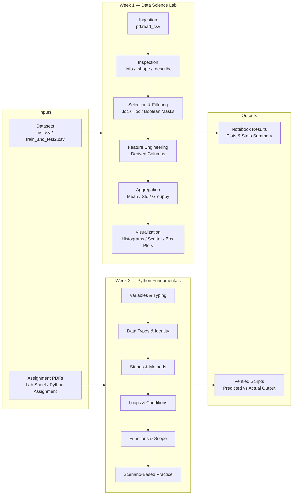

<div align="center">

# 📊 Data Science and Visualization Lab

A structured repository documenting weekly experiments, exploratory data analysis (EDA), statistical computations, and visual analytics for the **B.Tech CSE (AI & Data Science)** curriculum.


</div>

---

## 📌 Overview

This repository contains the practical work completed across weekly lab experiments for the **Data Science and Visualization Lab (BCSE0593)** course, along with supporting Python fundamentals practice.

- **Week 1** builds a foundation in Python data structures using **Pandas** and **NumPy**, hands-on EDA, real-world dataset operations (indexing, boolean filtering, feature engineering), and visualization with **Matplotlib**/**Seaborn**.
- **Week 2** covers core Python fundamentals — variables, dynamic typing, data types, object identity, string methods, loops, conditionals, functions, and scope — through a dedicated practice assignment.

---

## ✨ Features & Task Breakdown

### 🧪 Week 1 — Experiment 01 Implementations

| | Task | Description & Details |
| :---: | :--- | :--- |
| 🔹 | **Task 1: Data Structure Creation** | Constructed 1D Pandas Series and 2D DataFrames from dictionaries, lists, and arrays with custom row index labeling. |
| 🔍 | **Task 2: Metadata & Inspection** | Utilized `.shape`, `.info()`, `.head()`, `.tail()`, and `.describe()` to extract key structural summary statistics. |
| 🎯 | **Task 3: Selection & Subsetting** | Executed row/column extractions using label-based (`loc[]`) and positional-based (`iloc[]`) indexing logic. |
| 🚦 | **Task 4: Conditional Filtering** | Applied multi-condition boolean masks on continuous numeric variables to filter dataset subsets. |
| ⚙️ | **Task 5: Feature Engineering** | Generated calculated columns (e.g., `sepal_aspect_ratio = SepalLength / SepalWidth`) and dropped redundant features using `.drop()`. |
| 📈 | **Task 6: Statistical Aggregation** | Computed central tendency (mean, median, mode) and variance metrics (standard deviation, min, max) grouped across categories. |
| 📊 | **Task 7: Visual Data Analytics** | Built histograms, scatter plots, and box plots to observe feature distributions and spot outliers. |

### 🐍 Week 2 — Python Fundamentals Assignment

| | Topic | Description & Details |
| :---: | :--- | :--- |
| 🔸 | **Topic 1: Variables & Dynamic Typing** | Explored reassignment across types without declarations, contrasted with statically typed languages like C/Java. |
| 🔸 | **Topic 2: Common Data Types** | Practiced `int`, `float`, `str`, `bool`, `list`, and `tuple`, including mutability differences. |
| 🔸 | **Topic 3: Identity vs Equality** | Compared `is` (object identity) vs `==` (value equality), including Python's small-integer caching behavior. |
| 🔸 | **Topic 4: Strings & Methods** | Applied `.upper()`, `.lower()`, `.title()`, `.strip()`, `.count()`, `.split()`, and reasoned about mutation vs reassignment. |
| 🔸 | **Topic 5: Loops** | Wrote `for`/`range()` and `while` loop equivalents, including step arguments and reverse ranges. |
| 🔸 | **Topic 6: Conditions & Modulo** | Built even/odd checks and FizzBuzz using `if`/`elif`/`else` and `%`. |
| 🔸 | **Topic 7: Functions & Arguments** | Implemented custom functions (e.g., `my_abs`), and reasoned about pass-by-value-of-reference behavior. |
| 🔸 | **Topic 8: Scope** | Distinguished local vs global variables and used the `global` keyword to mutate global state. |
| 🔸 | **Scenario Questions (Q1–Q11)** | Applied all topics to real-world mini scenarios — shopping cart, student ID card, ticket pricing, attendance counter, and more. |

---

## 🧱 Workflow Architecture



---

## 📂 Project Structure

Matches the actual repository layout — one top-level folder per week, each self-contained with its own inputs and solutions.

```
Data_Science_And_Visualization_Lab/
│
├── Week 1/
│   ├── datasets/
│   │   ├── Iris.csv                                 # Iris Flower Dataset
│   │   └── train_and_test2.csv                      # Titanic Survival Dataset
│   ├── Data_Science_and_visualization_Lab.ipynb      # Main Jupyter Notebook (Experiment 01)
│   └── BCSE0593_Lab_Experiment_01_Elaborated.pdf     # Lab Task Guidelines
│
├── week 2/
│   ├── Python_Assignment_final.pdf                   # Assignment questions (Topics 1-8 + Scenarios)
│   └── python_fundamentals_solutions.py              # Solved practice questions & scenario answers
│
└── README.md                                         # Repository Documentation
```

> **Note:** Folder names (`Week 1`, `week 2`) intentionally mirror the current casing in the GitHub repo. Consider standardizing to `week-1/` and `week-2/` in a future cleanup commit for consistency.

---

## 🛠️ Technology Stack

- **Python 3.x**
- **Pandas** — Data structures (Series, DataFrame), indexing (`loc`/`iloc`), filtering, statistics
- **NumPy** — Vectorized arrays, matrix operations, numerical computation
- **Matplotlib** — Low-level plotting framework, customized layout styling
- **Seaborn** — Statistical graphics, box plots, pairwise feature distribution plots
- **Jupyter Notebook / Google Colab / VS Code**

---

## ⚙️ Installation & Setup

### 🔹 1. Clone the Repository
```bash
git clone https://github.com/your-username/Data-Science-Lab.git
cd Data-Science-Lab
```

### 🔹 2. Set Up Virtual Environment (Optional)
```bash
# Create environment
python -m venv venv

# Activate on Windows
venv\Scripts\activate

# Activate on macOS/Linux
source venv/bin/activate
```

### 🔹 3. Install Dependencies
```bash
pip install pandas numpy matplotlib seaborn jupyter
```

### 🔹 4. Launch Week 1 Notebook
```bash
jupyter notebook "Week 1/Data_Science_and_visualization_Lab.ipynb"
```

### 🔹 5. Run Week 2 Scripts
```bash
python "week 2/python_fundamentals_solutions.py"
```

---

## 🖼️ Visualizations & Sample Output (Week 1)

**1. Feature Distribution (Histogram)**
Used to examine the distribution shape, variance, and skewness of continuous attributes like Sepal and Petal dimensions.

**2. Bivariate Feature Comparison (Scatter Plot)**
Constructed to evaluate relationships and correlations between numeric variables (e.g., `SepalLengthCm` vs `PetalLengthCm`).

**3. Outlier Identification (Box Plot)**
Employed box plots across features to detect statistical quartiles and flag potential outliers.

---

## 📜 Key Learning Outcomes

**Week 1**
- **Mastery of Pandas Data Structures** — Gained hands-on proficiency in constructing, indexing, and manipulating Pandas Series and DataFrames.
- **Data Subsetting Precision** — Standardized label-based (`loc`) vs positional (`iloc`) indexing methods for accurate data filtering.
- **Condition-based Querying** — Executed multi-variable boolean masks on real-world datasets.
- **Exploratory Visual Analytics** — Learned how to represent numerical feature relationships effectively to perform initial EDA.

**Week 2**
- **Dynamic Typing Fluency** — Understood how Python variables rebind across types without compile-time declarations.
- **Identity vs Equality** — Learned the distinction between `is` and `==`, including CPython's small-integer interning quirk.
- **String & Control Flow Proficiency** — Applied string methods, loop constructs, and conditionals to solve practical mini-problems.
- **Function Design & Scope** — Practiced argument passing, return values, and the `global` keyword for state mutation across scopes.

---

## 👥 Author

**Program:** B.Tech CSE (Specialization in AI & Data Science)
**Course:** Data Science and Visualization Lab (BCSE0593)
