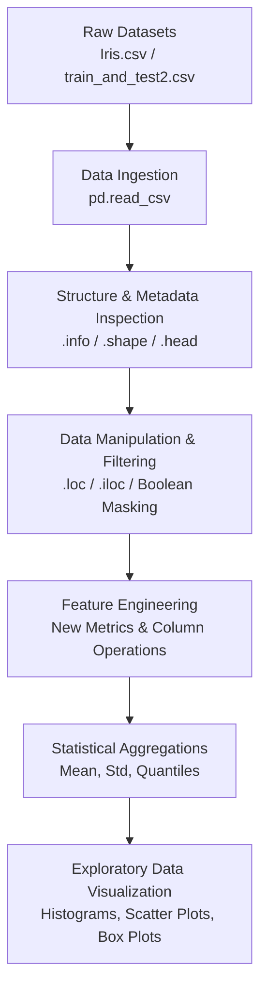

<div align="center">

# 📊 Data Science and Visualization Lab

A structured repository documenting weekly experiments, exploratory data analysis (EDA), statistical computations, and visual analytics for the **B.Tech CSE (AI & Data Science)** curriculum.


</div>

---

## 📌 Overview

This repository contains the practical work completed for **Lab Experiment 01** of the **Data Science and Visualization Lab (BCSE0593)** course.

The primary objective of this experiment is to build a strong foundation in Python data structures using **Pandas** and **NumPy**, perform hands-on Exploratory Data Analysis (EDA), handle real-world dataset operations (indexing, boolean filtering, feature engineering), and visualize key statistical properties using **Matplotlib** and **Seaborn**.

---

## ✨ Features & Task Breakdown

### 🧪 Experiment 01 Implementations

| | Task | Description & Details |
| :---: | :--- | :--- |
| 🔹 | **Task 1: Data Structure Creation** | Constructed 1D Pandas Series and 2D DataFrames from dictionaries, lists, and arrays with custom row index labeling. |
| 🔍 | **Task 2: Metadata & Inspection** | Utilized `.shape`, `.info()`, `.head()`, `.tail()`, and `.describe()` to extract key structural summary statistics. |
| 🎯 | **Task 3: Selection & Subsetting** | Executed row/column extractions using label-based (`loc[]`) and positional-based (`iloc[]`) indexing logic. |
| 🚦 | **Task 4: Conditional Filtering** | Applied multi-condition boolean masks on continuous numeric variables to filter dataset subsets. |
| ⚙️ | **Task 5: Feature Engineering** | Generated calculated columns (e.g., `sepal_aspect_ratio = SepalLength / SepalWidth`) and dropped redundant features using `.drop()`. |
| 📈 | **Task 6: Statistical Aggregation** | Computed central tendency (mean, median, mode) and variance metrics (standard deviation, min, max) grouped across categories. |
| 📊 | **Task 7: Visual Data Analytics** | Built histograms, scatter plots, and box plots to observe feature distributions and spot outliers. |

---

## 🧱 Workflow Architecture



---

## 📂 Project Structure

```
.
├── datasets/
│   ├── Iris.csv                                 # Iris Flower Dataset
│   └── train_and_test2.csv                      # Titanic Survival Dataset
│
├── Data_Science_and_visualization_Lab.ipynb     # Main Jupyter Notebook (Experiment 01)
├── BCSE0593_Lab_Experiment_01_Elaborated.pdf    # Lab Task Guidelines
└── README.md                                    # Repository Documentation
```

---

## 🛠️ Technology Stack

- **Python 3.x**
- **Pandas** — Data structures (Series, DataFrame), indexing (`loc`/`iloc`), filtering, statistics
- **NumPy** — Vectorized arrays, matrix operations, numerical computation
- **Matplotlib** — Low-level plotting framework, customized layout styling
- **Seaborn** — Statistical graphics, box plots, pairwise feature distribution plots
- **Jupyter Notebook / Google Colab / VS Code**

---

## ⚙️ Installation & Setup

### 🔹 1. Clone the Repository
```bash
git clone https://github.com/your-username/Data-Science-Lab.git
cd Data-Science-Lab
```

### 🔹 2. Set Up Virtual Environment (Optional)
```bash
# Create environment
python -m venv venv

# Activate on Windows
venv\Scripts\activate

# Activate on macOS/Linux
source venv/bin/activate
```

### 🔹 3. Install Dependencies
```bash
pip install pandas numpy matplotlib seaborn jupyter
```

### 🔹 4. Launch Jupyter Notebook
```bash
jupyter notebook Data_Science_and_visualization_Lab.ipynb
```

---

## 🖼️ Visualizations & Sample Output

**1. Feature Distribution (Histogram)**
Used to examine the distribution shape, variance, and skewness of continuous attributes like Sepal and Petal dimensions.

**2. Bivariate Feature Comparison (Scatter Plot)**
Constructed to evaluate relationships and correlations between numeric variables (e.g., `SepalLengthCm` vs `PetalLengthCm`).

**3. Outlier Identification (Box Plot)**
Employed box plots across features to detect statistical quartiles and flag potential outliers.

---

## 📜 Key Learning Outcomes

- **Mastery of Pandas Data Structures** — Gained hands-on proficiency in constructing, indexing, and manipulating Pandas Series and DataFrames.
- **Data Subsetting Precision** — Standardized label-based (`loc`) vs positional (`iloc`) indexing methods for accurate data filtering.
- **Condition-based Querying** — Executed multi-variable boolean masks on real-world datasets.
- **Exploratory Visual Analytics** — Learned how to represent numerical feature relationships effectively to perform initial EDA.

---

## 👥 Author

**Program:** B.Tech CSE (Specialization in AI & Data Science)
**Course:** Data Science and Visualization Lab (BCSE0593)
